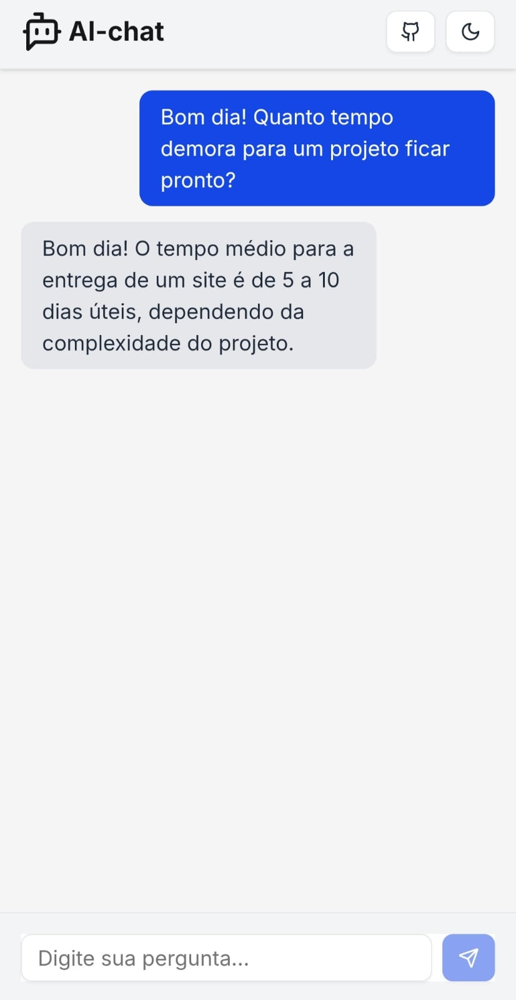
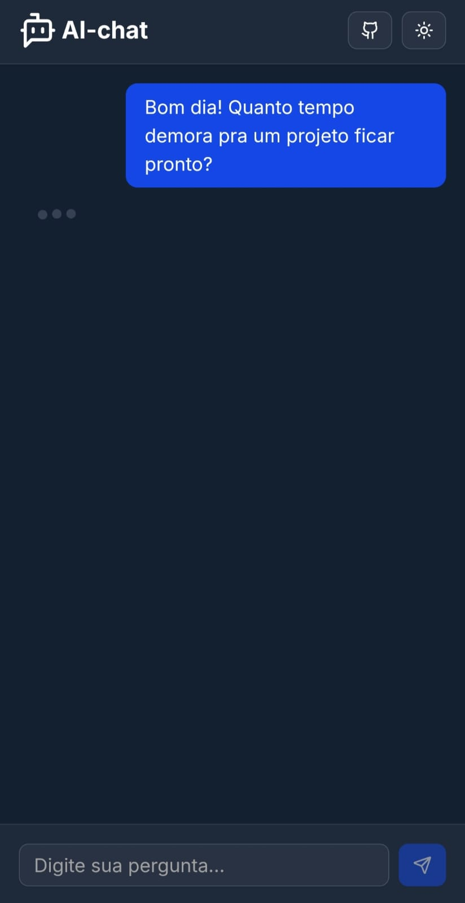

# 🤖 ai-chat-n8n

Um chatbot de atendimento integrado com inteligência artificial usando um agente IA, construído com Next.js (frontend) e
n8n (backend). O diferencial deste projeto é a simplicidade e escalabilidade: o backend é todo construído com automação
no n8n, sem uso de Node.js/Express.

---

<p style="display: flex; justify-content: center; gap: 2rem;">
  
  
</p>

---

## 📦 Tecnologias utilizadas

- [Next.js 14](https://nextjs.org/)
- [TailwindCSS](https://tailwindcss.com/)
- [shadcn/ui](https://ui.shadcn.com/) – componentes acessíveis e modernos
- [Axios](https://axios-http.com/) – requisições HTTP
- TypeScript
- [n8n](https://n8n.io/)
- API de IA (OpenAI/Gemini)

---

## 🛠 Como Funciona
### 📤 Fluxo do Frontend

- O usuário envia uma pergunta via interface (chat).
- A pergunta é enviada por POST para um endpoint local do n8n via Axios.

### 🤖 Fluxo do Backend com n8n

- O Webhook do n8n recebe a mensagem.
- Um nó de leitura lê o arquivo infos.json, que contém os dados institucionais (tempo de entrega, slogan, etc.).
- Os dados do infos.json são combinados com a pergunta em um prompt.
- Esse prompt é enviado para a API de AI, que gera uma resposta contextual.
- A resposta é devolvida diretamente para o frontend na mesma requisição POST.

---

## 🚀 Pré-requisitos

Antes de clonar e rodar o projeto, certifique-se de ter as seguintes ferramentas instaladas:

* **Node.js**: Versão 18 ou superior (recomendado para Next.js 14).
* **npm** ou **Yarn**: Gerenciadores de pacote JavaScript.
* **Git**: Para clonar o repositório.
* **n8n**: Para rodar o backend de automação. Você pode instalá-lo via npm (npm install -g n8n) ou Docker.
---


## 📡 Como Rodar o Projeto

1. Clonar o Repositório
```bash
git clone https://github.com/seuuser/ai-chat-n8n.git
cd ai-chat-n8n
```


### 🔧 Inicializar o Frontend
2. Instalar as Dependências do Frontend
```bash
npm install | yarn install
```

3. Iniciar o Frontend
```bash
npm run dev | yarn dev
```


### 📥 Importando o fluxo n8n

1. Inicie o n8n localmente:
```bash
n8n
```
2. Acesse o editor via navegador: http://localhost:5678

3. No topo da tela, clique em:
Workflows → Import from File

4. Selecione o arquivo ai-chat-n8n-flow.json incluído neste repositório na pasta n8n-flows.

5. O fluxo será carregado. Clique em Activate se quiser ativá-lo automaticamente.

> ⚠️ Observação <br>
> Este fluxo não inclui suas credenciais ou chaves de API (como a do OpenAI).
> Você precisará adicioná-las manualmente no painel de Credentials do n8n.

## 📈 Como escalar o projeto a partir daqui

Este projeto foi pensado para ser a base de algo maior. Abaixo estão alguns caminhos de evolução possíveis, tanto
técnicos quanto funcionais:

### 🧠 1. Adicionar memória conversacional
Permitir que a IA "lembre" das mensagens anteriores de uma conversa.

### 👥 2. Sistema de usuários
Permitir múltiplos usuários com login e preferências salvas.

### 💾 3. Persistência e analytics
Guardar estatísticas e usar dashboards para análise de uso. 7

### 🌐 4. Transformar em componente reutilizável
Reaproveitar o front como uma seção FAQ inteligente embutida em outros sites.

### 🔌 5. Escalar o backend
Passar do n8n local para algo mais robusto e disponível online.

### 🧩 6. Multi-modelo de IA
Trocar entre diferentes agentes ou APIs conforme o contexto.

> Cada etapa de evolução pode render novos aprendizados e até novos produtos! 🚀


## 👋 Sobre o Autor

Sou **Renan Const**, desenvolvedor fullstack e fundador da [InsightBrush](https://insightbrush.com.br) — uma iniciativa
focada em criar sites bonitos, rápidos e funcionais para quem quer presença online sem complicação.

Além de atuar como freelancer, compartilho aprendizados sobre desenvolvimento web, automações com IA e construção de
produtos digitais próprios.
Este projeto é um exemplo prático de como utilizar **Next.js** em conjunto com **n8n** para criar interfaces modernas e
fluxos inteligentes de atendimento.

🔗 Confira também o GitHub da [InsightBrush](https://github.com/InsightBrush) para mais soluções e projetos.

💬 Caso queira conversar sobre o projeto ou ter seu próprio site com um chat automatizado como este, sinta-se à vontade
para me chamar por aqui ou pelo site da InsightBrush.

## 📄 Licença

Este projeto está sob a licença MIT.